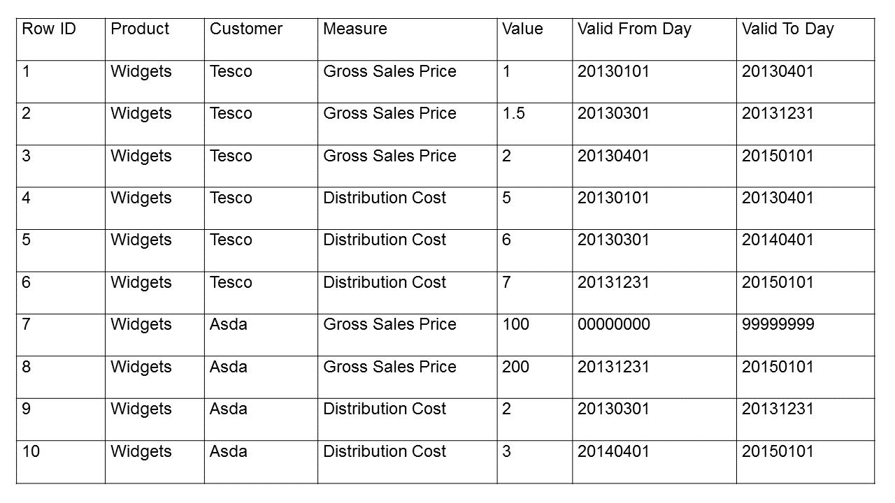

# Exceedra tech test

## Description

Create a process which solves parts A and B below; and then answer part C. Document your work using either a flowchart, pseudo-code, a written sequence of steps, or a programming language you are familiar with. The table below is example data, but your solution should be generic and hence applicable to any data supplied in this format.

  A.	Identify which pairs of rows have identical Products, Customers and Measures, and overlapping date ranges; e.g., as per rows 1 and 2.

  B.	Of the rows identified in part A, update the rows to make the date ranges not overlap.

  C.	Document any assumptions or decisions you needed to make for your solution.

  
  
## Approach and Assumptions

It took some time to decide on my approach for this task. By looking at the data I assume that the table is from a relational database. This is because of the unique ROW IDs in the first column. Also the format of the dates in the final two columns adheres to the format used for storing dates in a database.
Using this information I decided to use SQL to approach the task as this is a standard language for storing, (but more importantly in this case) manipulating and retrieving data from a database.

Studying the table I noticed certain relationships between the data, predominantly in the Customer and Measure columns. All the rows in the table have a unique Row ID but all have the same product 'Widgets'. I can also see that the Valid From and Valid To dates from Row ID '7' are not actual dates and I can assume that these are NULL values. I imagine that the entries are not simply left blank potentially due to a NOT NULL constraint on the column where by default a column cannot accept an empty or Null value.

To better understand and to help visualize these relationships I split the data into 4 groups. I have changed the date format slightly to make it easier to read.

Tesco - Gross Sales Price

| Value | Valid From Day | Valid To Day |
| :---: | :------------: | :----------: |
| 1     | 2013-01-01     | 2013-04-01   |
| 1.5   | 2013-03-01     | 2013-12-31   |
| 2     | 2013-04-01     | 2015-01-01   |

Tesco - Distribution Cost

| Value | Valid From Day | Valid To Day |
| :---: | :------------: | :----------: |
| 5 | 2013-01-01 | 2013-04-01 |
| 6 | 2013-03-01 | 2014-04-01 |
| 7 | 2013-12-31 | 2015-01-01 |

Asda - Gross Sales Price

| Value | Valid From Day | Valid To Day |
| :---: | :------------: | :----------: |
| 100 | 00000000 | 99999999 |
| 200 | 2013-12-31 | 2015-01-01 |

Asda - Distribution Cost

| Value | Valid From Day | Valid To Day |
| :---: | :------------: | :----------: |
| 2 | 2013-03-01 | 2013-12-31|
| 3 | 2014-04-01 | 2015-01-01|

